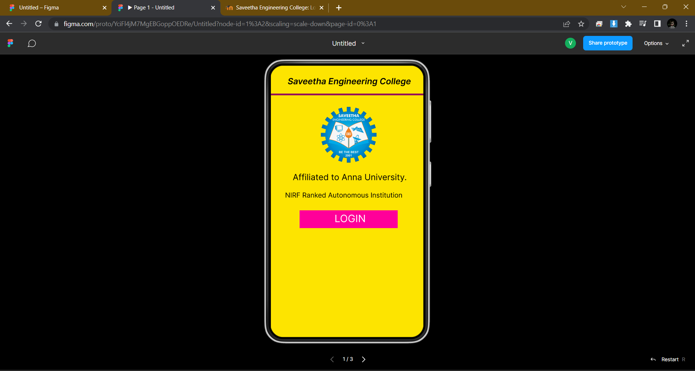

# Event Registration Web Application

## AIM:
To design, develop and deploy a web application for event registration.

## DESIGN STEPS:

### Step 1:
Create a new frame.

### Step 2:
Select any one preset size of your choice.

### Step 3:
Select the shapes you need.

### Step 4:
Import images as needed.

### Step 5:
Create pages based on your need and link them.

### Step 6:

Validate the HTML and CSS code.

### Step 6:

Publish the website in the given URL.

## DESIGN TOOL:
Figma
## code:
/* Login page */

position: relative;
width: 360px;
height: 640px;

background: #FF0099;
box-shadow: 0px 4px 4px rgba(0, 0, 0, 0.25);
position: absolute;
width: 131px;
height: 132px;
left: 114px;
top: 108px;

background: url(image.png);

/* Saveetha Engineering College */

position: absolute;
width: 334px;
height: 37px;
left: 13px;
top: 19px;

font-family: 'Inter';
font-style: normal;
font-weight: 400;
font-size: 12px;
line-height: 15px;
text-align: center;

color: #000000;

position: absolute;
width: 334px;
height: 37px;
left: 0px;
top: 25px;

font-family: 'Inter';
font-style: normal;
font-weight: 400;
font-size: 12px;
line-height: 15px;
text-align: center;

color: #000000;

/* Line 3 */

position: absolute;
width: 360px;
height: 0px;
left: 0px;
top: 70px;

border: 4px solid #000000;

/* image 2 */

position: absolute;
width: 131px;
height: 132px;
left: 114px;
top: 91px;

background: url(image.png);

/* Rectangle 2 */

position: absolute;
width: 261px;
height: 50px;
left: 60px;
top: 282px;

background: #00F0FF;

/* Rectangle 3 */

position: absolute;
width: 261px;
height: 50px;
left: 60px;
top: 400px;

background: #00F0FF;

/* Username */

position: absolute;
width: 209px;
height: 37px;
left: 60px;
top: 245px;

font-family: 'Inter';
font-style: normal;
font-weight: 400;
font-size: 20px;
line-height: 24px;

color: #FFFFFF;

/* Password */

position: absolute;
width: 235px;
height: 37px;
left: 64px;
top: 363px;

font-family: 'Inter';
font-style: normal;
font-weight: 400;
font-size: 20px;
line-height: 24px;

color: #FFFFFF;

/* Rectangle 2 */

position: absolute;
width: 231px;
height: 42px;
left: 75px;
top: 518px;

background: #1400FF;

/* SUBMIT */

position: absolute;
width: 208px;
height: 28px;
left: 90px;
top: 523px;

font-family: 'Inter';
font-style: normal;
font-weight: 400;
font-size: 24px;
line-height: 29px;
text-align: center;

color: #FFFFFF;

/* SEC Page */

position: relative;
width: 360px;
height: 640px;

background: #05E800;
box-shadow: 0px 4px 4px rgba(0, 0, 0, 0.25);

/* DEPARTMENTS */

position: absolute;
width: 334px;
height: 37px;
left: 13px;
top: 264px;

font-family: 'Inter';
font-style: normal;
font-weight: 400;
font-size: 24px;
line-height: 29px;
text-align: center;

color: #000000;

/* AI-DS */

position: absolute;
width: 334px;
height: 37px;
left: 13px;
top: 362px;

font-family: 'Inter';
font-style: normal;
font-weight: 400;
font-size: 24px;
line-height: 29px;
text-align: center;

color: #000000;

/* Line 4 */

position: absolute;
width: 360px;
height: 0px;
left: 0px;
top: 66px;

border: 4px solid #000000;

/* IOT */

position: absolute;
width: 334px;
height: 37px;
left: 13px;
top: 409px;

font-family: 'Inter';
font-style: normal;
font-weight: 400;
font-size: 24px;
line-height: 29px;
text-align: center;

color: #000000;

/* CC */

position: absolute;
width: 334px;
height: 37px;
left: 13px;
top: 456px;

font-family: 'Inter';
font-style: normal;
font-weight: 400;
font-size: 24px;
line-height: 29px;
text-align: center;

color: #000000;

/* AI-ML */

position: absolute;
width: 334px;
height: 37px;
left: 13px;
top: 325px;

font-family: 'Inter';
font-style: normal;
font-weight: 400;
font-size: 24px;
line-height: 29px;
text-align: center;

color: #000000;

/* Home page */

position: relative;
width: 360px;
height: 640px;

background: #FDE400;
box-shadow: 0px 4px 4px rgba(0, 0, 0, 0.25);

position: absolute;
width: 334px;
height: 37px;
left: 13px;
top: 25px;

font-family: 'Inter';
font-style: normal;
font-weight: 400;
font-size: 12px;
line-height: 15px;
text-align: center;

color: #000000;

/* Affiliated to Anna University. */

position: absolute;
width: 334px;
height: 37px;
left: 5px;
top: 251px;

font-family: 'Inter';
font-style: normal;
font-weight: 400;
font-size: 20px;
line-height: 24px;
text-align: center;

color: #000000;

/* NIRF Ranked Autonomous Institution */

position: absolute;
width: 334px;
height: 37px;
left: 5px;
top: 296px;

font-family: 'Inter';
font-style: normal;
font-weight: 400;
font-size: 16px;
line-height: 19px;
text-align: center;

color: #000000;

/* Line 1 */

position: absolute;
width: 360px;
height: 0px;
left: 0px;
top: 70px;

border: 4px solid #93075B;

/* Line 2 */

position: absolute;
width: 360px;
height: 0px;
left: 0px;
top: 70px;

border: 4px solid #93075B;

/* image 1 */

position: absolute;
width: 131px;
height: 132px;
left: 118px;
top: 97px;

background: url(image.png);

/* Rectangle 1 */

position: absolute;
width: 231px;
height: 42px;
left: 68px;
top: 341px;

background: #FF0099;

/* LOGIN */

position: absolute;
width: 208px;
height: 28px;
left: 83px;
top: 346px;

font-family: 'Inter';
font-style: normal;
font-weight: 400;
font-size: 24px;
line-height: 29px;
text-align: center;

color: #FFFFFF;
## OUTPUT:

## RESULT:
The program to design, develop and deploy a web application for event registration is completed successfully.